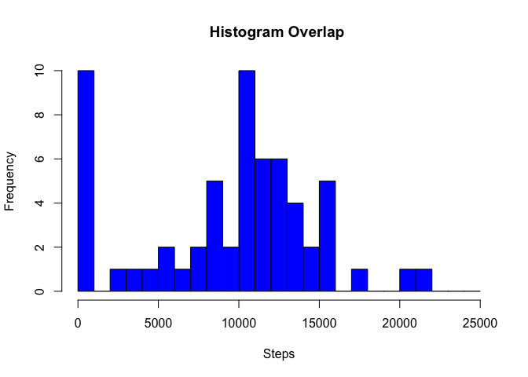
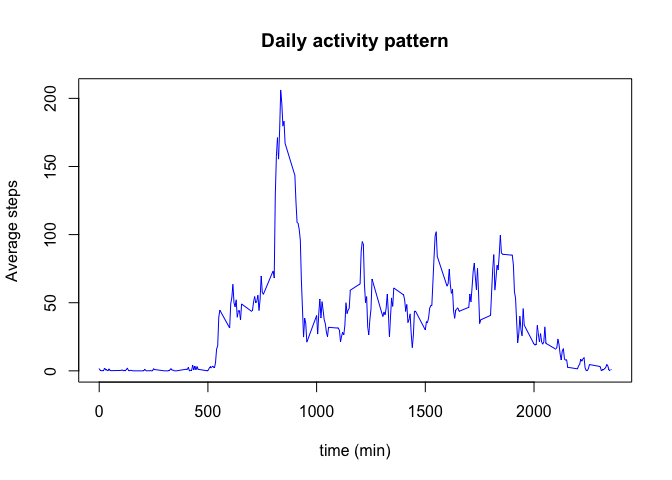
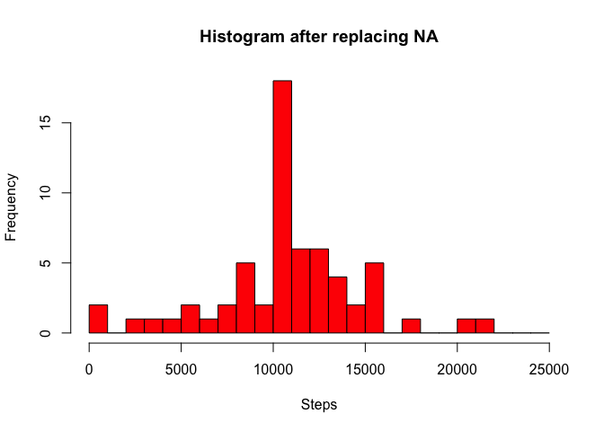
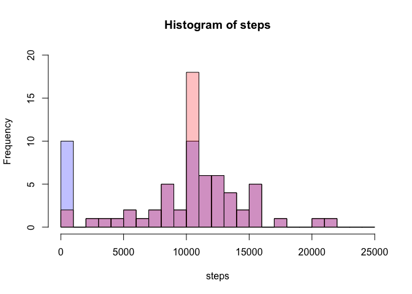
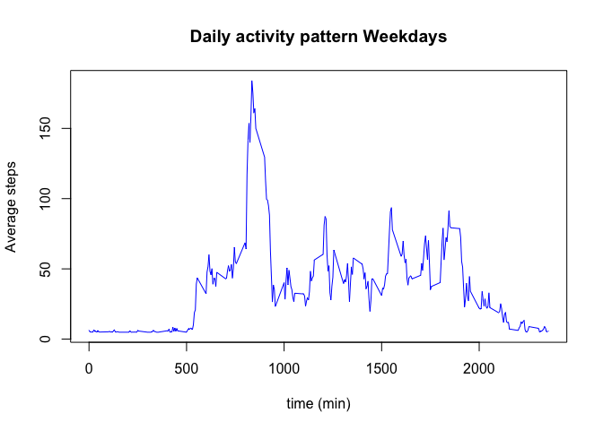

# Reproducible Research: Peer Assessment 1


## Loading and preprocessing the data

```r
# Loading Data
options(warn=-1)
   data<- read.csv("activity.csv")
# Subsetting and finding mean steps per day
    day <- levels(data$date)
    steps <- vector("numeric",length(day))
    for (i in seq_along(day)){
        vect <- which(data$date == day[i])
        steps[i]<-sum(data$steps[vect], na.rm=TRUE)
    }
```
## Histogram of steps 

```r
p1 <- hist(steps, col = 'blue', breaks = seq(from = 0, to = 25000, by = 1000), main = 'Histogram Overlap ', xlab = 'Steps')
```

 

##What is mean total number of steps taken per day?

```r
meansteps <- mean(steps)
mediansteps <- median(steps)
```
The mean and meadian total number of steps take per day is 9354.2295082 & 1.0395\times 10^{4} respectively.

## What is the average daily activity pattern?

```r
# Subsetting to cover 5 minute interval
    interval <- data$interval[1:288]
    insteps <- vector("numeric",length(interval))
    for (i in seq_along(interval)){
        vect <- which(data$interval == interval[i])
        insteps[i]<-mean(data$steps[vect], na.rm = TRUE)
    }
```
####Plotting the pattern


```r
plot(interval,insteps,type="l",col = 'blue', main = "Daily activity pattern", xlab = "time (min)", ylab = "Average steps" )
```

 

####Maximum number of steps


```r
maxsteps <-max(insteps)
maxstepsinterval <- interval[which(insteps==maxsteps)]
```

At 835  minutes, the maximum number of steps (206.1698113) were taken on average across all days

## Imputing missing values

```r
good <- complete.cases(data)
missing <- length(data$steps)-length(data$steps[good])
```

There are 2304 rows of missing values.


```r
# replaced NA values over average steps/interval over all intervals
temp <- replace(data$steps, is.na(data$steps), mean(insteps))
newsteps <- vector("numeric",length(day))
for (i in seq_along(day)){
    vect <- which(data$date == day[i])
    newsteps[i]<-sum(temp[vect])
}
```


```r
p2 <- hist(newsteps, col = 'red', breaks = seq(from = 0, to = 25000, by = 1000), main = 'Histogram after replacing NA', xlab = 'Steps')
```

 

As you can see in the overlap below, the number of 0 step days reduced in frequency, while gaining on the 10,000+ steps

```r
plot( p1, col=rgb(0,0,1,1/4), ylim = c(0,20) )  # first histogram
plot( p2, col=rgb(1,0,0,1/4), ylim = c(0,20), add=T)  # second
```

 

## Are there differences in activity patterns between weekdays and weekends?


```r
# Subsetting to cover 5 minute interval for Weekdays
    wkdays<-weekdays(as.Date(data$date))
    wkdaysteps <- vector("numeric",length(interval))
    wkendsteps <- vector("numeric",length(interval))
    for (i in seq_along(interval)){
        if (wkdays != "Sunday" && wkdays != "Saturday"){
            vect <- which(data$interval == interval[i])
            wkdaysteps[i]<-mean(temp[vect])
        }else{
            vect <- which(data$interval == interval[i])
            wkendsteps[i]<-mean(temp[vect])    
        }
    }
```


```r
plot(interval,wkdaysteps,type="l",col = 'blue', main = "Daily activity pattern Weekdays", xlab = "time (min)", ylab = "Average steps" )
```

 

```r
plot(interval,wkendsteps,type="l",col = 'red', main = "Daily activity pattern Weekends", xlab = "time (min)", ylab = "Average steps" )
```

 
